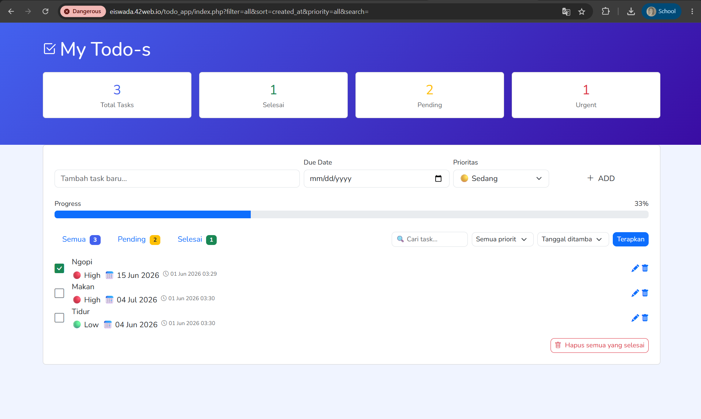

# Portofolio Praktikum Pemrograman Web 1  
Kumpulan tugas Praktikum Pemrograman Web 1 
Program Studi TRPL — Semester 2  ---  

## Tentang Saya  
| Info  | Detail                | 
|-------|-----------------------| 
| Nama  | Putrie Araya Iswad    | 
| NIM   | 25/557089/SV/26097    | 
| Prodi | TRPL                  |

## 🚀 Demo Live

🔗 Project CRUD To Do App: https://eiswada.42web.io/todo_app
🔗 Project CRUD Data Mahasiswa: https://eiswada.42web.io/praktikum_crud

---

## 📂 Daftar Tugas

| Bab | Topik                  | Folder                        |
|-----|------------------------|-------------------------------|
| 02  | Dasar-dasar HTML       | bab-02-dasar-dasar-html/      |
| 03  | Link Frame dan Tabel   | bab-03-link-frame-tabel/      |
| 04  | Form dan Gambar        | bab-04-form-dan-gambar/       |
| 05  | Stylesheet             | bab-05-stylesheet/            |
| 06  | Pengenalan Flex-Box    | bab-06-flexbox/               |
| 07  | Stylesheet 2           | bab-07-stylesheet-2/          |
| 08  | Bootstrap              | bab-08-bootstrap/             |
| 09  | Design Website         | bab-09-design-website/        |
| 10  | JavaScript             | bab-10-javascript/            |
| 11  | JavaScript 2           | bab-11-javascript-2/          |
| 12  | PHP                    | bab-12-php/                   |
| 13  | PHP 2                  | bab-13-php-2/                 |
| 14  | CRUD                   | bab-14-crud/                  |
---

## 📸 Screenshot

 
 

---

## 🛠️ Teknologi yang Digunakan

HTML · CSS · JavaScript · PHP · MySQL · Bootstrap

---

*© 2025 Putrie Araya Iswada*